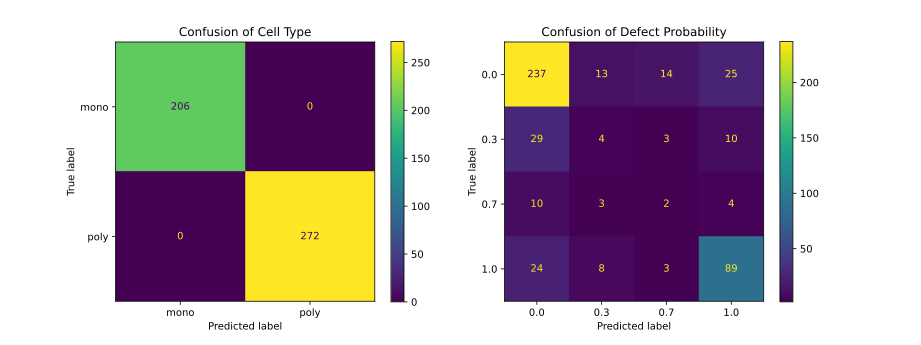

# CNN-based Solution of the ELPV dataset

[](LICENSE.md)
[](https://github.com/RichardLitt/standard-readme)

> CNN-based identification of defective solar cells in electroluminescence imagery.


## Table of Contents

- [Background](#background)
- [Install](#install)
- [Usage](#usage)
- [Results](#results)
- [License](#license)


## Background

The life span is an important aspect of photovoltaic (PV) modules.
Electroluminescence (EL) imaging is an established technique for the visual
inspection of PV modules. It enables identification of defects in
solar cells that may impede the life span of the module. However, manual
inspection of EL images is tedious and requires expert knowledge. Therefore,
an automated pipeline may enable high-throughput quality assessment of
PV modules.

In this work, we present a convolutional neural network (CNN) architecture that
predicts the defect probability and their structural type (mono- vs.
polycrystalline) of PV modules from EL images. We used a [dataset][elpv-dataset] of 2'624 EL images provided by Buerhop-Lutz, Deitsch
et.&nbsp;al.[^1]&nbsp;[^2]&nbsp;[^3].


[^1]: Buerhop-Lutz, C.; Deitsch, S.; Maier, A.; Gallwitz, F.; Berger, S.; Doll, B.; Hauch, J.; Camus, C. & Brabec, C. J. A Benchmark for Visual Identification of Defective Solar Cells in Electroluminescence Imagery. European PV Solar Energy Conference and Exhibition (EU PVSEC), 2018. DOI: [10.4229/35thEUPVSEC20182018-5CV.3.15](https://doi.org/10.4229/35thEUPVSEC20182018-5CV.3.15)
[^2]: Deitsch, S., Buerhop-Lutz, C., Sovetkin, E., Steland, A., Maier, A., Gallwitz, F., & Riess, C. (2021). Segmentation of photovoltaic module cells in uncalibrated electroluminescence images. Machine Vision and Applications, 32(4). DOI: [10.1007/s00138-021-01191-9](https://doi.org/10.1007/s00138-021-01191-9)
[^3]: Deitsch, S.; Christlein, V.; Berger, S.; Buerhop-Lutz, C.; Maier, A.; Gallwitz, F. & Riess, C. Automatic classification of defective photovoltaic module cells in electroluminescence images. Solar Energy, Elsevier BV, 2019, 185, 455-468. DOI: [10.1016/j.solener.2019.02.067](https://doi.org/10.1016/j.solener.2019.02.067)


## Install

This project uses [`pipenv`](https://github.com/pypa/pipenv) to manage its
dependencies. You may install it via `pip install pipenv`.

```sh
git clone --recurse-submodules https://github.com/a-ludi/cnn-elpv-dataset.git
pipenv install
```


## Usage

### Evaluation Mode

In evaluation mode the main script produces several plots and outputs that
describe the dataset and the predictions of a pre-trained CNN (see
[Training Mode](#training-mode) below). This is the default mode of operation.
Execute the script like this:

```sh
pipenv run python cnn-elpv-dataset.py
```

### Training Mode

The CNN will be trained if the main script is executed on a SLURM cluster or
the environment variable `export TRAINING=1` is provided. Execute like this:

```sh
export TRAINING=1 # only unless executing on SLURM

pipenv run python cnn-elpv-dataset.py
```


## Results

### Inspection of Input Data

The [dataset][elpv-dataset] contains 2'624 EL images of size 300×300 pixels.
The pixels are stored as integers in the range 0-255. Each image is labelled
with a cell type, `mono` or `poly` for mono-/polycrystalline, resp.), and, with
a defect probability which can take one of four values 0, ⅓, ⅔ or 1. The defect
probabilities are encoded as floats.

The cell type was known _a priori_. The labels were collected by consulting experts. The experts were presented one image at a time and asked two questions

1. Is the solar cell defective or functional?
2. Are you sure or unsure?


The labels are non-uniformly distributed as can be seen in a histogram.


While training, we compensated for the non-uniformity in the distribution of probabilities by weighting the influence of each data point with the inverse
relative frequency of the associated defect probability.
The distribution between cell types was considered negligible.


### Preprocessing of Input Data

We converted the images to 3-channel RGB by broadcasting the gray values to
all 3 channels equally. Then, we normalized to values to the range [-1, 1] as
expected by the CNN we employed.

The cell types were one-hot-encoded (`0 = mono`, `1 = poly`) and convert to
`bool` for memory-efficient storage.

The defect probabilities were left unchanged.

The whole dataset was split into three randomly chosen sets:

1. Validation set of 478 rows.
2. Test set of 525 rows.
3. Training set of 2'099 rows.


### Model definition

Generally, we feed the images into a CNN and pass the results through
fully-connected layers to predict cell type and defect probability. We
interpreted predicting the defect probability as a regression problem rather
than a classification. Based on these conditions, we implemented several architectures gradually improving the prediction quality.
<!-- TODO insert table/graph of metrics -->


#### Architecture v1

The first version is based on a pre-trained [MobileNet v3
Large][MobileNetV3Large][^4] without the fully-connected layer at the
top of the network. The weights were initialized by pre-training on ImageNet as
provided by Keras.

The outputs of the CNN are flattened into a vector of 96'000 values and passed
into a fully-connected layers with one output to predict the cell type. To
predict the defect probability, the flattened features from the CNN are
concatenated with the predicted cell type, forming a 96'001-element vector, and
passed into a fully-connected layer with 1'024 outputs, which are passed into
the last fully-connected layer with a single output. All fully-connected layers
use the sigmoid activation function.


[^4]: A. Howard, M. Sandler, G. Chu, L.-C. Chen, B. Chen, M. Tan, W. Wang, Y. Zhu, R. Pang, V. Vasudevan, Q. V. Le, H. Adam, Searching for MobileNetV3. [arXiv:1905.02244](https://arxiv.org/abs/1905.02244). DOI: [10.48550/arXiv.1905.02244](https://doi.org/10.48550/arXiv.1905.02244)


#### Architecture v2

The second version uses a modified network after the CNN. The cell type network
remains the same as it produced perfect results in v1. The defect probability
gets predicted by using two separate fully-connected layer that are responsible
for each of the two cell types: the flattened CNN-features are passed into two
separate fully-connected layers with a single output. These outputs are
multiplied by either the cell type prediction `x` or its inverse `1 - x`
inducing responsibilities. The two results are combined in a fully-connected
layer with a single output. As before, all fully-connected layers use the
sigmoid activation function.


#### Architecture v3

The third version improves even further on the defect probability prediction
by strictly separating the two fully-connected layers. The is achieved by
replacing the multiply-and-merge unit with a simple binary multiplexer that
takes the cell type prediction and the two outputs from the fully-connected
layers and passes through one of the latter two depending on the cell type
prediction.


### Training

The network was trained in two steps. First, the cell type prediction network
was trained with fixed weights in the CNN. Second, the full network including
the CNN was trained based on that pre-training.

We used binary cross-entropy as loss function for the cell type and
mean squared error (MSE) for the defect probability. The loss functions were
weighted 1:2 because the cell type prediction converges much more easily than
the defect probability prediction. We used RMSprop as an optimizer with a
reduced learning rate of 10<sup>4</sup>. Additionally, we employed an adaptive
adjustment scheme ([ReduceLROnPlateau]) for the learning rate to increase the
learning success. Getting the learning rate right is crucial for success because
the training of these models is rather unstable.

We trained for 500 epochs although the loss function does not improve
significantly after 300 epochs.


### Evaluation of Predictions

First, we evaluated both cell type and defect probability predictions in a
confusion matrix. We had to quantize the defect probabilities into four
classes for this kind of analysis. In order to represent each class with
equally-sized sub-intervals of [0, 1] we multiplied the probabilities by four
and rounded towards zero and limited the values to a maximum of 3.

    p_class = min(3, floor(4 * p))



The cell type is predicted perfectly as the off-diagonal entries of the
confusion matrix are zero. However, there are some mis-classifications among the
predicted defect probabilities. Since we see the problem as a regression, predicting 0 where ⅓ is expected or vice versa presents no problem at all,  especially, because this is the difference between the expert being sure or unsure about their judgement. Still, in 23 cases a 0 was predicted but a 1
expected and in 21 cases the other way around. These cases present serious
mistakes and will be investigated further.

Before going into detail, we evaluated the defect probability prediction by
distribution plots that are a more natural this problem.


We plotted for each of the four true defect probability values a distribution
of the predictions. It is immediately apparent that most of the images are
correctly predicted. However, the network seems to have trouble predicting the
uncertainty of the experts. In our opinion, this seems is to be expected
because, after all, the expert is uncertain, so why should the network be
certain? Another problem are the long tails in the 0 and 1 bins which correspond
to the serious mis-classifications discussed earlier.

To investigate these serious mistakes more deeply, we extracted 8 sample images
which are labelled with a defect probability of 0 and the network predicted 1,
and 8 samples labelled with 1 but predicted 0.


In our modest opinion, some of the expert classifications are hard to make out.
However, we are no ELPV experts. Therefore, we leave this problem open to
discussion and further improvement.


[elpv-dataset]: https://github.com/zae-bayern/elpv-dataset
[MobileNetV3Large]: https://keras.io/api/applications/mobilenet/#mobilenetv3large-function
[ReduceLROnPlateau]: https://www.tensorflow.org/api_docs/python/tf/keras/callbacks/ReduceLROnPlateau


## License

[![Creative Commons License][cc-by-nc-sa-4.0-logo]][cc-by-nc-sa-4.0]

This work is licensed under a [Creative Commons
Attribution-NonCommercial-ShareAlike 4.0
International License][cc-by-nc-sa-4.0].

[cc-by-nc-sa-4.0-logo]: https://i.creativecommons.org/l/by-nc-sa/4.0/88x31.png
[cc-by-nc-sa-4.0]: http://creativecommons.org/licenses/by-nc-sa/4.0/
